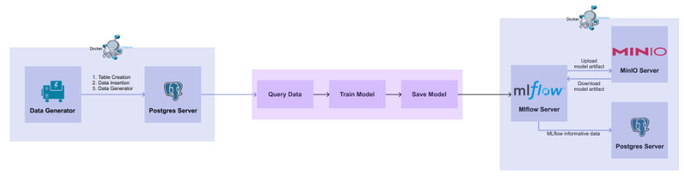
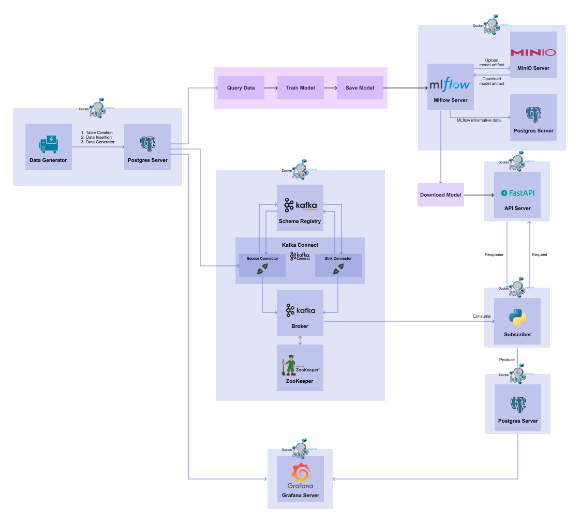

# Project (미완성)
- mlops를 ML 엔지니어가 경험해보기
- [해당 내용](https://mlops-for-mle.github.io/tutorial/docs/intro)을 따라가는 프로젝트
- 2023.02.20 ~ 2023.02.28

# TIL
## 01. Database
- What
    - DB server 생성
    - 데이터 생성
### 진행과정
1. DB 서버 생성
    -  `docker run -d --name postgres-server -p 5432:5432 -e POSTGRES_USER=minsoo -e POSTGRES_PASSWORD=1234 -e POSTGRES_DB=mydb postgres:14.0`
2. DB 서버 확인
    - psql [설치](https://www.postgresql.org/download/)
    - 설치하고 해당 명령어로 db 서버 생성 `PGPASSWORD=mypassword psql -h localhost -p 5432 -U myuser -d mydatabase`
```
psql (15.2 (Ubuntu 15.2-1.pgdg20.04+1), server 14.0 (Debian 14.0-1.pgdg110+1))
Type "help" for help.

mydb=# \du
                                   List of roles
 Role name |                         Attributes                         | Member of 
-----------+------------------------------------------------------------+-----------
 minsoo    | Superuser, Create role, Create DB, Replication, Bypass RLS | {}

mydb=# 
```
1. 테이블 생성
    - `pip install pandas psycopg2-binary scikit-learn`
    - `psycopg2`를 이용하여 테이블을 생성해본다.
    - [`.py`](./01_database/01_create_table.py)을 실행하여 테이블을 생성한다.
    - `PGPASSWORD=mypassword psql -h localhost -p 5432 -U myuser -d mydatabase`로 db에 접속하여 만들어졌는지 확인해본다.

2. 데이터 생성 및 테이블에 삽입
    - [`.py`](./01_database/02_data_insert.py)를 실행하여 데이터를 테이블에 삽입한다. (3초간격으로 row 하나씩)

3. `docker compose`를 이용하여 container 환경에서 데이터 생성 및 db에 저장
    - 데이터 저장용 DB container와 데이터 생성해서 DB에 삽입하는 container 2개가 필요하다.
    - 서로 통신이 가능해야하므로 docker compose를 이용한다.
    - DB container는 기존의 image를 사용하고 데이터 생성 container는 [`Dockerfile`](./01_database/Dockerfile)을 이용한다.
    - [`docker-compose.yaml`](./01_database/docker-compose.yaml)을 만들고 `docker compose up -d` 명령어를 이용해서 container를 띄운다.
        - DB container가 잘 띄워진다음 데이터를 생성해서 보내기 위해 `healthcheck`기능을 이용한다.

## 02. Model Development
1. db에서 최근 100개의 데이터를 불러서 모델을 만들고 `joblib`으로 훈련된 모델을 저장한다. (뒤에서 mlflow로 저장하는 코드로 바꿀 예정) [`.py`](./02_model_develop/01_db_train.py)
2. 저장된 모델을 불러와서 validation을 진행한다. [`.py`](./02_model_develop/02_db_validate_save_model.py)

## 03. Model Registry



1. mlflow 환경 만들기
    - [`docker-compose.yaml`](./03_model_registry/docker-compose.yaml)에
        - MLflow 의 운영 정보, 모델 결과 등을 저장할 물리적인 PostgreSQL DB 서버 스펙을 정의
        - 학습된 모델을 저장할 물리적인 저장 공간인 MinIO 서버 스펙을 정의
        - 모델과 모델의 결과들을 관리할 MLFlow 서버를 정의
    - localhost:5001에서는 mlflow ui를 localhost:9001에서는 minio ui를 볼 수 있다.
2. 모델 저장하기
    - [`.py`](./03_model_registry/01_save_model_to_registry.py)를 실행하면 모델이 저장된다. mlflow web을 통해서 관련 내용을 확인할 수 있다.
3. 모델 불러오기
    - [`.py`](./03_model_registry/02_load_model_from_registry.py)을 실행하면 (run_id를 알아야함) 저장된 모델을 불러올 수 있다.
        - run_id는 mlflow web에서 확인할 수 있다. (내 run_id = cc53b918d0a149ee8aa8020e292f2ea1)

## 04. Model Deployment
## 05. FastAPI
## 06. API Serving
1. 모델 다운로드
    - 일단 [`.py`](./06_api_serving/01_download_model.py)를 통해서 모델을 다운받는다.
    - 그러면 [`sk_model`](./06_api_serving/sk_model/)이라는 폴더가 생긴다.
2. FastAPI를 통해서 api를 구현한다.
    - pydantic을 이용하여 schema를 구현한다. [`.py`](./06_api_serving/schemas.py)
    - 그리고 app을 만든다. [`.py`](./06_api_serving/app.py)
3. docker compose로 container 띄우기
    - [`Dockerfile`](./06_api_serving/Dockerfile)
    - [`docker-compose.yaml`](./06_api_serving/docker-compose.yaml)
4. api가 잘되는지 확인한다.
    - `curl -X POST http://localhost:8000/predict -H "Content-Type: application/json" -d '{"sepal_length": 6.7, "sepal_width": 3.3, "petal_length": 5.7, "petal_width": 2.1}'`
    - swagger ui를 이용해도 된다. (`localhost:8000/docs`) 
- 나중에 08.Stream부분에서 input DB의 데이터를 API에 post하고 예측결과를 ouput DB에 저장한다.


**이후 내용은 추후에 Kafka를 공부하고 진행할 예정이다.**

## 07. Kafka
- 데이터가 계속 쌓이고 있고 이를 실시간으로 모델에 넣어서 결과를 쌓아야하는 상황 (Stream)
- 이때 활용할 수 있는게 Kafka이다.


## 08. Stream
- Consumer를 통해 토픽으로부터 데이터를 읽어와서 API 서버의 입력으로 전달하고, inference 결과를 반환받아 Target DB 로 전달하는 Data Subscriber 를 구현
- Grafana를 통해 원본 데이터와 예측 결과 값을 실시간으로 시각화하는 대시보드 구현

